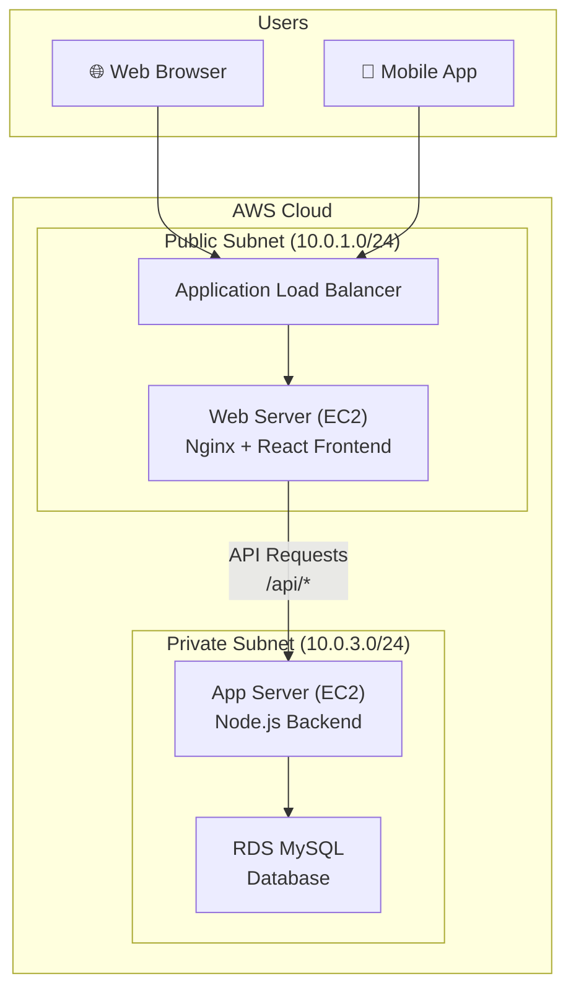
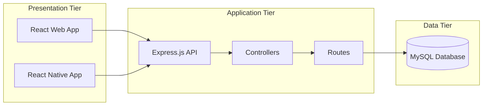
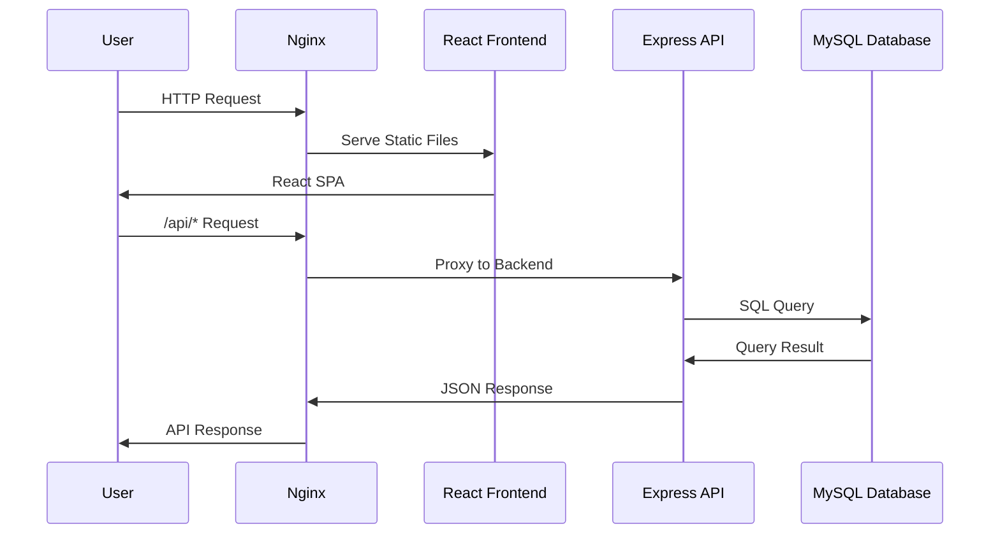
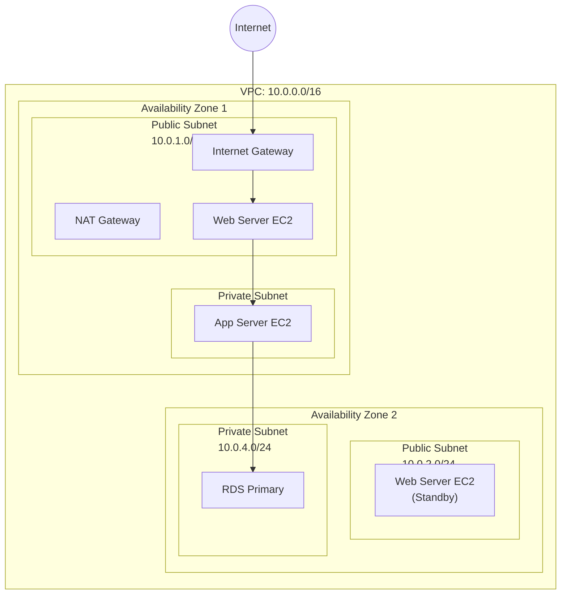
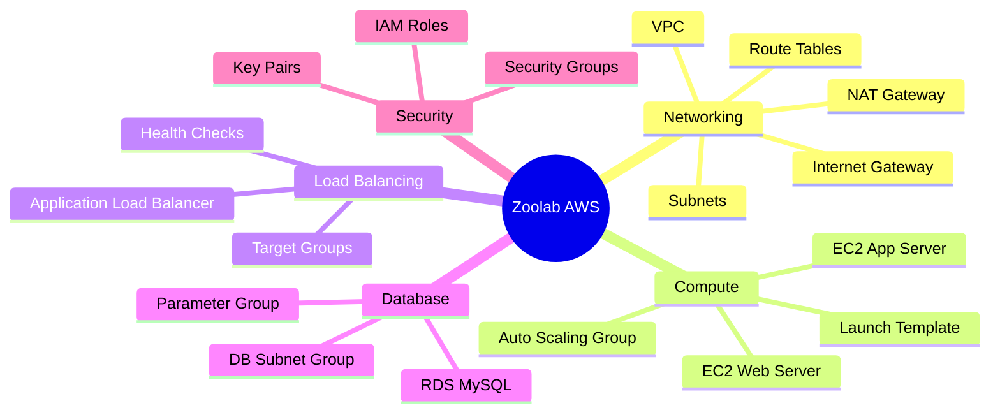
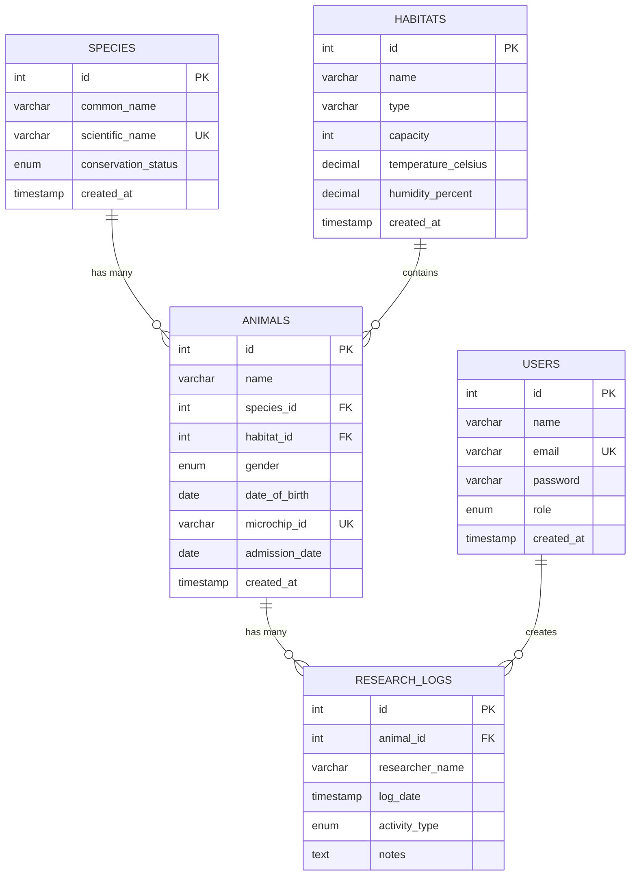
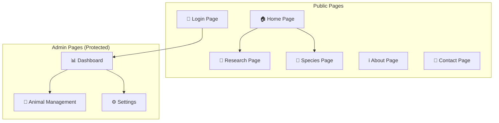
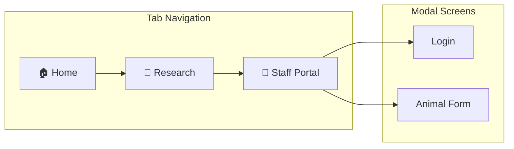

# Zoolab - Cloud-Based Wildlife Research Management System

## Complete Project Documentation

---

## Table of Contents

1. [Project Overview](#project-overview)
2. [System Architecture](#system-architecture)
3. [Cloud Infrastructure](#cloud-infrastructure)
4. [Database Design](#database-design)
5. [API Documentation](#api-documentation)
6. [Frontend Application](#frontend-application)
7. [Mobile Application](#mobile-application)
8. [Deployment Guide](#deployment-guide)
9. [Security Considerations](#security-considerations)

---

## Project Overview

**Zoolab** is a comprehensive cloud-based wildlife research management system designed to help researchers and zoo staff monitor, track, and study animals. The system leverages AWS cloud infrastructure to provide scalable, reliable, and secure access to research data.

### Key Features

- 🐘 **Animal Management** - Track individual animals with detailed records
- 🔬 **Species Catalog** - Maintain species information with conservation status
- 🏠 **Habitat Monitoring** - Manage research environments and enclosures
- 📝 **Research Logging** - Record observations, health checks, and behavioral studies
- 🔐 **Staff Authentication** - Secure role-based access control
- 📱 **Mobile Access** - Native mobile app for field researchers
- ☁️ **Cloud Deployment** - Scalable AWS infrastructure

### Technology Stack

| Layer | Technology |
|-------|------------|
| **Frontend** | React 18, Vite, Tailwind CSS |
| **Mobile** | React Native, Expo |
| **Backend** | Node.js, Express.js |
| **Database** | AWS RDS (MySQL) |
| **Cloud** | AWS (EC2, VPC, ALB, RDS) |
| **IaC** | Terraform |

---

## System Architecture

### High-Level Architecture



### Three-Tier Architecture



### Component Interaction



---

## Cloud Infrastructure

### VPC Architecture



### Security Groups

| Security Group | Inbound Rules | Purpose |
|----------------|---------------|---------|
| **zoolab-web-sg** | HTTP (80) from 0.0.0.0/0, HTTPS (443) from 0.0.0.0/0 | Allow public web traffic |
| **zoolab-app-sg** | TCP 3000 from zoolab-web-sg | Allow API traffic from web tier only |
| **zoolab-db-sg** | MySQL (3306) from zoolab-app-sg | Allow database connections from app tier |

### AWS Resources



---

## Database Design

### Entity Relationship Diagram



### Table Descriptions

| Table | Purpose | Records |
|-------|---------|---------|
| **species** | Catalog of animal species with conservation status | 6 species |
| **habitats** | Research environments/enclosures with climate data | 4 habitats |
| **animals** | Individual animals with tracking information | 8 animals |
| **research_logs** | Daily observations and health records | Varies |
| **users** | Staff authentication and authorization | 3 users |

---

## API Documentation

### Base URL
```
Production: http://ec2-XX-XX-XX-XX.eu-north-1.compute.amazonaws.com/api
Local: http://localhost:3000/api
```

### Endpoints

#### Authentication

| Method | Endpoint | Description | Request Body |
|--------|----------|-------------|--------------|
| `POST` | `/login` | Staff authentication | `{ email, password }` |

#### Animals

| Method | Endpoint | Description | Request Body |
|--------|----------|-------------|--------------|
| `GET` | `/animals` | Get all animals | - |
| `POST` | `/animals` | Create new animal | `{ name, species_id, habitat_id, gender, date_of_birth, microchip_id }` |
| `PUT` | `/animals/:id` | Update animal | `{ name, species_id, habitat_id, gender, date_of_birth, microchip_id }` |
| `DELETE` | `/animals/:id` | Delete animal | - |

#### Species & Habitats

| Method | Endpoint | Description |
|--------|----------|-------------|
| `GET` | `/species` | Get all species |
| `GET` | `/habitats` | Get all habitats |

#### System

| Method | Endpoint | Description |
|--------|----------|-------------|
| `GET` | `/test-db` | Test database connection |
| `GET` | `/tables` | List database tables |

### Response Format

```json
{
  "status": "success",
  "data": [ ... ],
  "message": "Optional message"
}
```

### Error Response

```json
{
  "status": "error",
  "message": "Error description"
}
```

---

## Frontend Application

### Page Structure



### Key Features

- **Responsive Design** - Mobile-first approach with Tailwind CSS
- **Dark Theme** - Modern dark UI with glassmorphism effects
- **Authentication** - JWT-based session management
- **Real-time Stats** - Dynamic data from API
- **CRUD Operations** - Full animal management

### Directory Structure

```
frontend/
├── src/
│   ├── components/     # Reusable UI components
│   │   ├── Navbar.jsx
│   │   ├── Sidebar.jsx
│   │   └── RequireAuth.jsx
│   ├── context/        # React Context providers
│   │   └── AuthContext.jsx
│   ├── layouts/        # Page layouts
│   │   └── AdminLayout.jsx
│   ├── pages/          # Route pages
│   │   ├── Home.jsx
│   │   ├── Research.jsx
│   │   ├── Species.jsx
│   │   ├── Login.jsx
│   │   ├── Dashboard.jsx
│   │   └── Animals.jsx
│   ├── services/       # API services
│   │   └── api.js
│   ├── App.jsx         # Root component
│   └── index.css       # Global styles
├── dist/               # Production build
└── package.json
```

---

## Mobile Application

### Technology

- **Framework**: React Native with Expo
- **Navigation**: Expo Router (file-based routing)
- **State Management**: React Context API
- **API Communication**: Fetch API

### Screens



### Directory Structure

```
mobile/
├── app/
│   ├── (tabs)/         # Tab navigation screens
│   │   ├── index.tsx   # Home screen
│   │   ├── research.tsx
│   │   └── staff.tsx
│   ├── login.tsx       # Login modal
│   └── _layout.tsx     # Root layout
├── context/
│   └── AuthContext.tsx
├── services/
│   └── api.js
└── package.json
```

---

## Deployment Guide

### Prerequisites

- AWS Account with appropriate permissions
- Node.js 20+ installed
- Git installed
- SSH key pair for EC2 access

### Step 1: Database Setup

1. Create RDS MySQL instance in AWS
2. Configure security group to allow connections
3. Run schema.sql to create tables

### Step 2: Backend Deployment

```bash
# On EC2 App Server
cd ~/app/backend
npm install
nano .env  # Configure environment variables
nohup npm start > server.log 2>&1 &
```

### Step 3: Frontend Deployment

```bash
# On EC2 Web Server
cd ~/app/frontend
npm install
npm run build
# Configure nginx to serve dist folder
sudo systemctl restart nginx
```

### Step 4: Nginx Configuration

```nginx
server {
    listen 80;
    server_name _;
    
    root /home/ec2-user/app/frontend/dist;
    
    location / {
        try_files $uri $uri/ /index.html;
    }
    
    location /api {
        proxy_pass http://127.0.0.1:3000;
        proxy_http_version 1.1;
        proxy_set_header Host $host;
        proxy_set_header X-Real-IP $remote_addr;
    }
}
```

### Environment Variables

```bash
# Backend .env
DB_HOST=your-rds-endpoint.amazonaws.com
DB_USER=admin
DB_PASSWORD=your-password
DB_NAME=zoolab
PORT=3000
```

---

## Security Considerations

### Implemented

- ✅ Network isolation with VPC and private subnets
- ✅ Security groups with least privilege access
- ✅ HTTPS-ready infrastructure
- ✅ Session-based authentication
- ✅ Protected admin routes

### Recommended for Production

- 🔲 Implement password hashing (bcrypt)
- 🔲 Add JWT token authentication
- 🔲 Enable SSL/TLS certificates
- 🔲 Implement rate limiting
- 🔲 Add input validation and sanitization
- 🔲 Enable AWS CloudWatch monitoring
- 🔲 Configure backup strategies for RDS

---

## Project Statistics

| Metric | Value |
|--------|-------|
| **Total Files** | ~50+ |
| **Frontend Components** | 15+ |
| **API Endpoints** | 8 |
| **Database Tables** | 6 |
| **Lines of Code** | ~3,000+ |

---

## Authors

**Cloud Computing and Virtualization (DIT3202)**  
Semester 5 Project

---

*Last Updated: December 2025*
